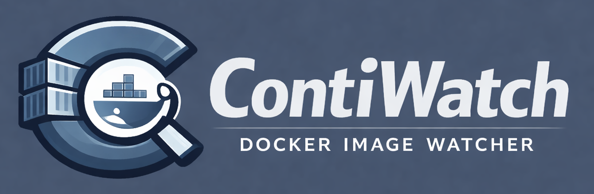

# Contiwatch

<p align="center">
  
</p>

**Contiwatch** monitors Docker images, detects updates, optionally recreates containers, and sends Discord notifications. Its web UI manages local Docker hosts and token-authenticated remote agents.

## Features

- Compare registry and local image digests to detect updates.
- Choose notification-only, automatic update, or skip policies per container.
- Monitor local Docker daemons and remote agents from one controller.
- Pause scans and updates per server with maintenance mode.
- Manage containers, Compose stacks, images, networks, and volumes.
- Inspect container logs, resource metrics, and interactive shells.
- Schedule scans with Basic, Cron, or legacy interval plans.
- Configure Discord notifications for startup, detected updates, and update results.

## Quick start

Install Docker Engine and Docker Compose, then work from a repository checkout. Edit [docker-compose.yml](docker-compose.yml) and replace the `APP_PIN` placeholder with a unique, non-trivial PIN containing **4–8 digits**. The controller will not start with the placeholder. Keep the named volume mounted at `/data` to retain configuration and stack files.

The Compose file publishes port 8080 on the host. Restrict access to a trusted private network or put the service behind an HTTPS reverse proxy. Docker socket access allows management of host containers; reserve access for trusted administrators. Automatic scans are disabled and the default policy is `notify_only`.

```bash
docker compose up -d
```

Open `http://localhost:8080` and unlock the UI with your PIN. For remote hosts, configure `CONTIWATCH_AGENT=true` and a unique `CONTIWATCH_AGENT_TOKEN` of at least 32 random characters, using the [agent installation guide](docs/installation.md#remote-agent).

Other startup settings, including `CONTIWATCH_ADDR`, `CONTIWATCH_CONFIG`, and `TZ`, are listed in the [configuration reference](docs/configuration.md#environment-variables). Alternative installation, upgrades, and permission troubleshooting are in the installation guide below.

## Documentation

- [Installation and operation](docs/installation.md) — Compose, local builds, agents, image tags, upgrades, and permissions.
- [Configuration](docs/configuration.md) — environment variables, defaults, schedules, servers, and secret updates.
- [User guide](docs/user-guide.md) — policies, scans, stack environments, server health, and agent updates.
- [API reference](docs/api.md) — routes, authentication, controller/agent differences, and response contracts.
- [Deployment security](docs/security.md) — PIN sessions, proxy trust, protected files, and compatibility boundaries.
- [Discord notifications](docs/discord-webhook.md) — notification content and delivery conditions.
- [Release checks](docs/release-check.md) — build versions, release channels, image tagging, and update detection.
- [Development and verification](docs/testing.md) — build requirements, checks, and isolated test resources.
- [Authentication ADR](docs/ADR/ADR-001-controller-authentication-boundaries.md) — accepted authentication and compatibility decisions.
- [Toast implementation record](docs/toast-overlay-plan.md) — implemented behavior and remaining validation criteria.
- [Debug filter proposal](docs/events-debug-filter-plan.md) — proposed Events filtering with configuration decisions still open.

## Project links

- [Changelog](CHANGELOG.md)
- [Source and issues](https://github.com/pbuzdygan/contiwatch)
- [Releases](https://github.com/pbuzdygan/contiwatch/releases)

## Buy Me a Coffee

If you like the results of this project, feel free to support it.

[](https://www.buymeacoffee.com/pbuzdygan)
<p align="left">
  
</p>
